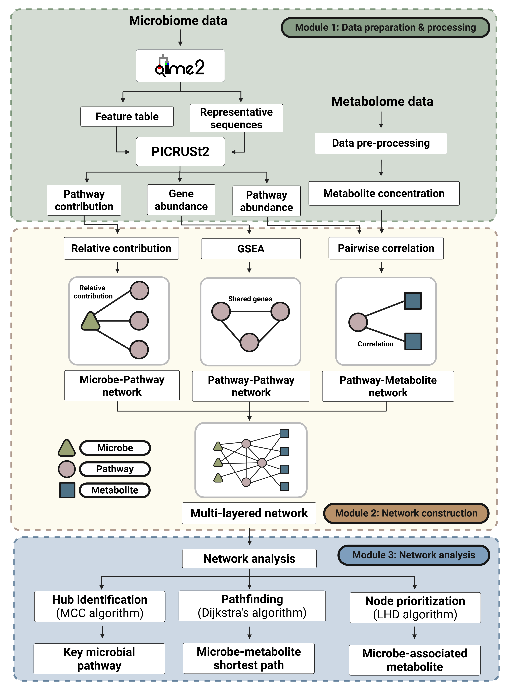

## NUIM: Network-based utility for integrating microbiome and metabolome data

We developed NUIM, a modular, network-based framework for integrating microbiome and metabolome data systematically. NUIM consists of three modules: (1) data preparation and processing, (2) network construction, and (3) network analysis.



### Module 1: Data Preparation and Processing

This module defines the procedures required to prepare and process the input data for downstream network construction and analysis.

- Input data includes `microbial sequencing reads in FASTQ format` and `metabolite concentration table`.  
- Microbiome data processing involves the use of QIIME2 to generate a feature table and representative sequences. These outputs are subsequently processed using PICRUSt2 for functional prediction, yielding gene abundance, pathway abundance, and pathway contribution data.  
- Although metabolome data processing may vary depending on user preference and experimental design, NUIM assumes that metabolite concentrations have been appropriately processed by standard practice. For example, users may employ established platforms such as Metabox or MetaboAnalyst to perform normalization, transformation, and quality control of metabolomics data.


---

```markdown
### PICRUSt2 Command Line Example

```bash
# Place representative sequences fasta file in your working directory
# Run PICRUSt2 pipeline for functional prediction

picrust2_pipeline.py \
  -s rep-seqs.fasta \
  -i feature-table.biom \
  -o picrust2_out \
  -p 4

# Outputs include predicted gene family abundances, pathway abundances, and pathway contributions
```

### Module 2: Network Construction

This module constructs a tripartite network linking microbial taxa, metabolic pathways, and metabolites. The network is composed of the following components:

- The microbe–pathway network is constructed from pathway contribution data, with edges representing the relative contribution of each microbe to specific pathways.  
- The pathway–pathway network is constructed using pathways identified as significant through Gene Set Enrichment Analysis (GSEA). Edges between pathways are defined based on shared genes, and Jaccard indices represent edge weights.  
- The pathway–metabolite network is constructed by calculating pairwise correlation (e.g., Spearman or Pearson) between pathway abundance and metabolite concentrations.  
- These networks are finally integrated through connected pathway nodes to construct a multi-layered network.

### Module 3: Network Analysis

This module provides three network analyses designed to identify context-specific associations:

- The hub identification uses the Maximal Clique Centrality (MCC) algorithm to identify key microbial pathways.  
- The pathfinding uses the Dijkstra's algorithm to identify the shortest path between the selected source and target nodes.  
- The node prioritization uses the Laplacian Heat Diffusion (LHD) algorithm to identify microbe-associated metabolites.
